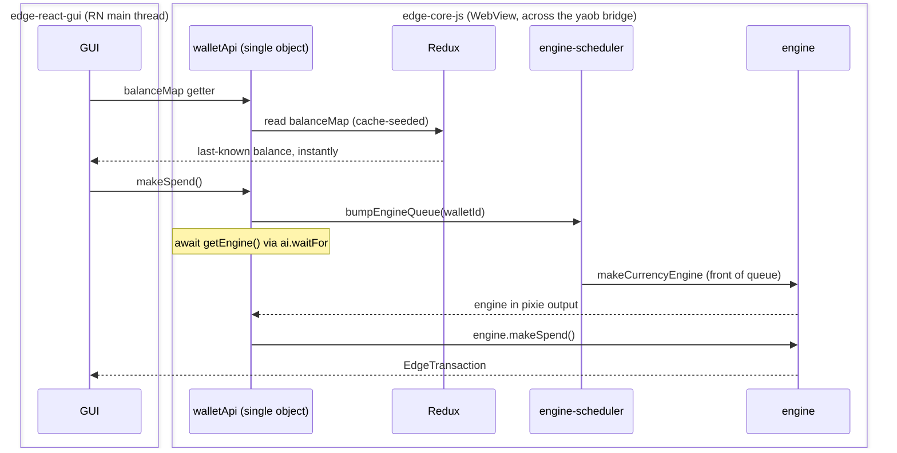
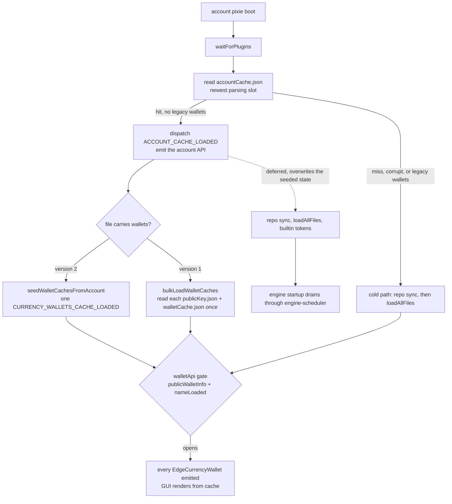
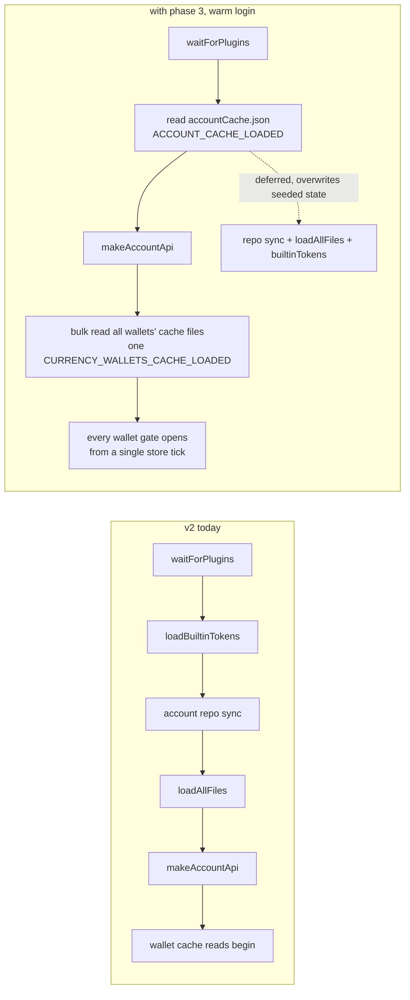

# Wallet cache v2: instant wallet UI at login

| | |
|---|---|
| Status | Implemented (phases 1-7 in review) |
| Author | Jon Tzeng |
| Reviewer | William Swanson |
| Last updated | 2026-08-17 |
| Repos | [EdgeApp/edge-core-js](https://github.com/EdgeApp/edge-core-js), [EdgeApp/edge-react-gui](https://github.com/EdgeApp/edge-react-gui) |
| Implementation | [edge-core-js#733](https://github.com/EdgeApp/edge-core-js/pull/733), [edge-react-gui#6080](https://github.com/EdgeApp/edge-react-gui/pull/6080) |
| Supersedes | [edge-core-js#703](https://github.com/EdgeApp/edge-core-js/pull/703) (Cache and restore wallets) |
| Related | [edge-core-js#709](https://github.com/EdgeApp/edge-core-js/pull/709) (Reduce UI lag, tabled), [architecture comparison vs #703](https://gist.github.com/j0ntz/7ea32da5dc8d23a1fd46d16fd121cda1), [write-path audit](https://gist.github.com/j0ntz/94c3e64779a92e8a1ae1896f4d7d3d6f), Asana: [Login Perf - Wallet Cache v2](https://app.asana.com/1/9976422036640/project/1213843652804305/task/1216673467164267) |

[Section 1](#1-problem) through [section 7](#7-gui-integration-edge-react-gui) describe the implementation as it stands on the branch; every code block is captioned with the file and commit it was pulled from. Line references to unchanged code are to edge-core-js `master` at v2.47.0 (1b2a25e7) and to edge-react-gui `develop`. The architectural direction comes from the William x Jon call of 2026-07-17. How the design moved between that call and the current shape is in [section 8](#8-phase-history-and-709-disposition), the rationale behind each contested choice is in [section 9](#9-decisions), and what the document got wrong is in [section 12](#12-post-implementation-retrospective).

## Contents

1. [Problem](#1-problem)
2. [Why #703 is not the implementation](#2-why-703-is-not-the-implementation)
3. [Goals and non-goals](#3-goals-and-non-goals)
4. [Design overview](#4-design-overview)
5. [Detailed design: edge-core-js](#5-detailed-design-edge-core-js)
6. [Testing](#6-testing)
7. [GUI integration: edge-react-gui](#7-gui-integration-edge-react-gui)
8. [Phase history and #709 disposition](#8-phase-history-and-709-disposition)
9. [Decisions](#9-decisions)
10. [Glossary](#10-glossary)
11. [References](#11-references)
12. [Post-implementation retrospective](#12-post-implementation-retrospective)

## 1. Problem

Measured from the last PIN digit to a usable wallet list, login is slow because the GUI cannot render balances until currency engines exist. The chain on master:

1. The GUI gets no `EdgeAccount` until plugins load, account repos sync, and key files load (`src/core/account/account-pixie.ts:52-118`).
2. Each wallet's `walletApi` [pixie](#pixie) refuses to emit until `engine != null && publicWalletInfo != null && nameLoaded` (`src/core/currency/wallet/currency-wallet-pixie.ts:209`).
3. In the engine pixie, `plugin.makeCurrencyEngine` sits behind repo sync, `loadTxFileNames`, and key derivation, and the name/fiat file loads are sequenced after engine creation (`currency-wallet-pixie.ts:78-201`, name/fiat at 186-187).
4. Core never persists balances. They live only in Redux (`balanceMap`), populated by engine callbacks after startup.

So even the wallet's name waits behind engine creation, and balances wait behind engine startup plus network. QA measured the caching approach in #703 at roughly a 5x login improvement. William confirmed the finding on the 2026-07-17 call: the cost of one extra disk read per wallet is far below the cost of loading engines up front.

Engine loading also causes visible jank after login (disk, key derivation, network on the JS thread). The startup queue in [section 8](#8-phase-history-and-709-disposition) is what addresses that.

## 2. Why #703 is not the implementation

#703 proved the concept and is the reason we know the win is real. It was rejected on architecture, not on results:

- It builds a second, parallel implementation of `EdgeCurrencyWallet` and `EdgeCurrencyConfig` (543-line `cached-currency-wallet.ts` plus config, loader, saver, delegation utilities; ~3,200 lines total). Two implementations of the same interface means every future API change must be made twice, and each copy has its own bugs. Review findings bore this out: stale Redux snapshots in the loader, an initial save that wiped token definitions, non-bridgified `otherMethods`, pollers that outlive logout.
- The merged `currencyWallets` getter allocated a fresh object per read. [yaob](#yaob) diffs by `===`, so unstable references cause superfluous or missing bridge updates (William's inline review comment, 2026-02-26).
- Cached wallets delegate to real ones through a 500 ms poll with a 60 s timeout, and four setters must remember to call `update()` by hand or the GUI wedges (the paused-state variant causes an infinite boot loop, per the PR's own design doc).

Direction agreed on the call: keep one wallet implementation. Feed cached data into the existing Redux state and the existing `walletApi` object, and make the engine an awaitable dependency inside that object instead of a construction parameter.

## 3. Goals and non-goals

Goals:

- Wallet list with names, fiat codes, enabled tokens, and last-known balances renders as soon as per-wallet cache files load, before any engine exists.
- One `EdgeCurrencyWallet` implementation. No parallel objects, no delegation layer, no polling.
- Engine-dependent methods keep working: they wait for the engine internally and reject if it fails or the wallet is deleted.
- First login (no cache) behaves exactly as today.
- The GUI changes required by the new wallet-readiness semantics ship in the same phase ([section 7](#7-gui-integration-edge-react-gui)). A core change that breaks [FIO](#fio) refresh or action-queue checks is not done.
- Target size: a few hundred core lines plus two small GUI patches, not 3,000 (size actuals below).

Non-goals, as scoped on the call:

- Deferring or reordering engine creation. The engine [pixie](#pixie)'s imperative block was to run when it runs today, with only the GUI's wait for it removed. This one was taken back up and shipped as the startup queue ([section 8](#8-phase-history-and-709-disposition)).
- The #709 bridge-churn work. Tabled; see [section 8](#8-phase-history-and-709-disposition) for the one commit worth salvaging.
- [yaob](#yaob) changes. Any diffing improvements belong in the yaob repo, not shimmed around in core.

The call's size target was "a few hundred core lines plus two small GUI patches, not 3,000", set against [#703](https://github.com/EdgeApp/edge-core-js/pull/703)'s ~3,200. The branch is larger than that target and still well under the anchor it argued against; the estimate covered one phase of source and excluded tests, which are more than half the diff. Numbers are in the [retrospective](#12-post-implementation-retrospective).

## 4. Design overview

The login path caches what the GUI renders and moves everything else behind it:

- **One cache file.** `accountCache.json` on the account's local [disklet](#disklet) holds the account boot state and, per wallet, its name, fiat code, enabled tokens, last-known balances, receive addresses, `otherMethods` names, and public keys ([section 5.1](#51-cache-file)).
- **One read, one dispatch pair.** A bulk loader reads that file right after the plugins load and seeds Redux with two actions, one for the account and one carrying every wallet ([section 5.2](#52-load-path)). The account repo sync and the authoritative file loads run deferred behind the emit.
- **A gate that no longer waits for engines.** The `walletApi` gate drops its `engine != null` condition, so a wallet object emits as soon as its state is in Redux ([section 5.3](#53-gate-change)).
- **The engine as an awaitable dependency.** `makeCurrencyWalletApi` loses its `engine` and `tools` constructor parameters; methods that need them await internal waiters, and methods that read Redux are unchanged because the cache seeded that Redux ([section 5.4](#54-makecurrencywalletapi-changes)).
- **One writer.** A single throttled account-level saver owns the file, so a sync window costs one write no matter how many wallets changed ([section 5.5](#55-save-path)).
- **A queue in front of engine startup.** Engine creation drains 8 wallets at a time, with the wallet the user opened moved to the front ([section 8](#8-phase-history-and-709-disposition)).

The wallet object is created once and never replaced. When the engine lands, the same object starts answering engine-backed calls. [yaob](#yaob) reference stability is preserved by construction: the [pixie](#pixie) output map and the `walletApi` object are the same ones master uses today.

Work splits across two repos:

| Repo | Deliverable | Scope |
|---|---|---|
| edge-core-js | [#733](https://github.com/EdgeApp/edge-core-js/pull/733) | Cache file and cleaners, bulk load path, gate change, API waiters, account cache saver ([section 5](#5-detailed-design-edge-core-js)), engine startup scheduler ([section 8](#8-phase-history-and-709-disposition)) |
| edge-react-gui | [#6080](https://github.com/EdgeApp/edge-react-gui/pull/6080) | Engine-readiness gates for action-queue balance effects and [FIO](#fio) refresh, `waitForWalletOtherMethods` helper ([section 7](#7-gui-integration-edge-react-gui)) |

How a cache-window method call resolves once both land (symbols as shipped):



## 5. Detailed design: edge-core-js

Cold-start byte-equivalence is a standing requirement of this section, guarded by [test case 1](#6-testing).

### 5.1 Cache file

One file, `accountCache.json` on the account's local [disklet](#disklet), holds the account boot state and every wallet's cached UI state, public keys included. Storing per-wallet data in one account-level file rather than a file per wallet is [decision 9.6](#96-one-account-cache-file-not-per-wallet-files).

The file is written to two alternating slots (`accountCache.json`, `accountCache.2.json`), each carrying a monotonic `sequence`; the reader takes the newest slot that parses, which is the torn-write defense ([decision 9.10](#910-two-slot-alternation-because-the-disklet-has-no-rename)).

Schema:

[`src/core/account/account-cleaners.ts`](https://github.com/EdgeApp/edge-core-js/blob/51c0d4c5804cc2c621ecff2c75a265d297c42a61/src/core/account/account-cleaners.ts)
```ts
export interface AccountCacheFile {
  version: 2
  customTokens: EdgePluginMap<EdgeTokenMap>
  /**
   * True when the account has legacy Airbitz-repo wallets. Their
   * wallet infos cannot be cached (they contain private keys), so
   * such accounts boot cold rather than briefly hiding wallets.
   */
  legacyWallets: boolean
  walletStates: EdgeWalletStates
  /**
   * Each plugin's `otherMethods` names, so `CurrencyConfig` can
   * expose delegating stubs even if the plugin has not loaded yet.
   */
  configOtherMethodNames: EdgePluginMap<string[]>

  /**
   * Every active wallet's cached boot state, keyed by wallet id.
   * This absorbs what used to live in each wallet's own
   * `publicKey.json` + `walletCache.json` pair, so a warm boot reads
   * one file for the whole account instead of two per wallet.
   */
  wallets: { [walletId: string]: AccountCacheWallet }

  /**
   * Increases on every write. Two slots hold alternating generations,
   * so the reader can take the newest one that still parses; see
   * `loadAccountCache`.
   */
  sequence: number
}

export interface AccountCacheWallet {
  walletInfo: { id: string; keys: object; type: string }
  name: string | null
  fiatCurrencyCode: string
  enabledTokenIds: string[]

  /** Integer strings. The `null` tokenId is spelled '' here. */
  balances: { [tokenId: string]: string }

  /** Per tokenId, without balances (`null` tokenId spelled ''). */
  addresses: {
    [tokenIdKey: string]: Array<{ addressType: string; publicAddress: string }>
  }

  otherMethodNames: string[]
}
```

A version-1 file (no `wallets`) is upgraded on read rather than rejected, which is what sends an existing device through the migration in [section 5.2](#52-load-path). Balances are last-known values and are explicitly allowed to be stale.

### 5.2 Load path

The read happens once, at the account level, in the account [pixie](#pixie)'s boot block. Right after `waitForPlugins`, the boot reads `accountCache.json`; on a hit it seeds the account slice, emits the account API, and seeds every wallet from the same file it just read. The account repo sync and the authoritative file loads then run deferred behind that emit, with bounded retries because the GUI already holds the account.



The whole boot rides on two seeding actions. `ACCOUNT_CACHE_LOADED` seeds wallet states, custom tokens, and the per-plugin `otherMethods` names, and sets `keysLoaded` so wallet pixies spawn. `CURRENCY_WALLETS_CACHE_LOADED` carries one seed per wallet, and the wallet reducer's filter hands each wallet its own; a warm login therefore costs two seeding dispatches rather than two per wallet, and every pixie and watcher evaluates once against fully-seeded state. This is batching, not notification suppression: every consumer is still notified, once, with the final state, so it carries none of the missed-update risk that tabled [#709](https://github.com/EdgeApp/edge-core-js/pull/709) ([section 8](#8-phase-history-and-709-disposition)).

Each wallet's seed populates its Redux slice:

- `balanceMap` from cached balances, with a dirty-wins guard: the reducer ignores a cached value for any token the engine or a user action has already touched, so the cache never overwrites live data.
- `name`, setting `nameLoaded`, and `fiatCurrencyCode`, setting `fiatLoaded`, which is what opens the gate in [section 5.3](#53-gate-change).
- `enabledTokenIds`, the per-[tokenId](#tokenid) receive addresses, the `otherMethods` names, and `publicWalletInfo`.

The later `loadNameFile` / `loadFiatFile` / `loadTokensFile` dispatches overwrite the cached values with the authoritative synced-repo values, exactly as they overwrite initial state today. If the user renamed the wallet on another device, the cache shows the old name for a second or two, then corrects. Same class of staleness the GUI already tolerates for balances.

Two paths keep the per-wallet read alive. A wallet activated after login misses the bulk seed, so its own pixie reads its seed from the account cache, falling back to `publicKey.json` plus `walletCache.json`; and a device still on the version-1 layout takes that same per-wallet read once, after which the saver folds those wallets into the consolidated file. The old per-wallet files are left on disk as a recovery net and are never written again.

If the file is missing, fails its [cleaner](#cleaner), or the account holds legacy Airbitz wallets whose infos cannot be cached, the boot skips the seed entirely and runs the cold path: repo sync, then `loadAllFiles`, then the gate opens on the conditions master uses today. Cold-start behavior is unchanged, guarded by [test case 1](#6-testing).

### 5.3 Gate change

The `walletApi` pixie's gate, before and after:

```ts
// before
if (engine == null || publicWalletInfo == null || !nameLoaded) return
// after
if (publicWalletInfo == null || !nameLoaded) return
```

With the cache present, `publicWalletInfo` and `nameLoaded` are satisfied by the [load path](#52-load-path) and the wallet emits within one pixie tick of the cache read. Without the cache, `nameLoaded` flips only after `loadNameFile`, which still sits after engine creation, so the no-cache path is byte-for-byte today's behavior.

`engineStarted` (`currency-wallet-pixie.ts:224-285`) keeps its own conditions; the creation block it guards runs through the startup queue ([section 8](#8-phase-history-and-709-disposition)).

### 5.4 makeCurrencyWalletApi changes

`makeCurrencyWalletApi` (`src/core/currency/wallet/currency-wallet-api.ts:93`) drops `engine` and `tools` as parameters; the [cross-repo sequence diagram](#4-design-overview) shows how a GUI call rides these waiters across the [yaob](#yaob) boundary. Internal waiters replace them:

[`src/core/currency/currency-selectors.ts`](https://github.com/EdgeApp/edge-core-js/blob/51c0d4c5804cc2c621ecff2c75a265d297c42a61/src/core/currency/currency-selectors.ts)
```ts
/**
 * Waits for a wallet's engine to exist. The wallet API object can
 * exist before its engine does (a cache-seeded login), so
 * engine-backed methods wait here instead of throwing. Bails out if
 * the wallet is deleted mid-wait, and re-throws `engineFailure` so a
 * broken plugin surfaces as a rejection instead of a hang.
 */
export function waitForCurrencyEngine(
  ai: ApiInput,
  walletId: string
): Promise<EdgeCurrencyEngine> {
  // The caller needs this engine now, so skip the startup queue:
  bumpEngineQueue(ai, walletId)

  return ai.waitFor((props: RootProps): EdgeCurrencyEngine | undefined => {
    checkCurrencyWallet(props, walletId)
    return props.output.currency.wallets[walletId]?.engine
  })
}
```

The wallet API holds one waiter per dependency class: the engine, the plugin tools, and the storage repo.

[`src/core/currency/wallet/currency-wallet-api.ts`](https://github.com/EdgeApp/edge-core-js/blob/51c0d4c5804cc2c621ecff2c75a265d297c42a61/src/core/currency/wallet/currency-wallet-api.ts)
```ts
  function getEngine(): Promise<EdgeCurrencyEngine> {
    return waitForCurrencyEngine(ai, walletId)
  }

  async function getTools(): Promise<EdgeCurrencyTools> {
    return await getCurrencyTools(ai, pluginId)
  }

  /**
   * Methods that write synced-repo files need the storage wallet,
   * not the engine. The repo loads well before the engine,
   * so this wait is much shorter than `getEngine`.
   * A ready repo always wins: an unrelated engine failure must not
   * break storage-backed methods, so the failure check only matters
   * while the repo is still missing (the engine pixie died before
   * `addStorageWallet`, so the repo is never coming).
   */
  function getStorage(): Promise<true> {
    // The repo loads inside the queued startup work, so a caller
    // waiting on storage wants this wallet at the front too:
    bumpEngineQueue(ai, walletId)

    return ai.waitFor((props: RootProps): true | undefined => {
      if (props.state.storageWallets[walletId] != null) return true
      checkCurrencyWallet(props, walletId)
    })
  }
```

This is the `waitForCurrencyWallet` pattern (`src/core/currency/currency-selectors.ts:31-53`) with `walletApi` swapped for `engine`, keeping both of its guards (`checkCurrencyWallet` throws for a deleted wallet or an `engineFailure`). `waitForCurrencyEngine` lives in `currency-selectors.ts` because the account-level engine methods (`getActivationAssets`, `activateWallet`, `getDisplayPrivateKey`, `getDisplayPublicKey`) now ride the same waiter instead of throwing pre-engine, reading the account's wallet list only after the wait so wallets that finish loading during it are included ([`987632ca`](https://github.com/EdgeApp/edge-core-js/pull/733/commits/987632ca7d487b15ea71e851f14d5b6888ad209b)). The `bumpEngineQueue` calls are the startup queue's priority hook ([section 8](#8-phase-history-and-709-disposition)).

Method classification. Everything that reads Redux state today keeps its current body and works pre-engine because the cache seeded that state. Everything that touches `engine.` gains an `await getEngine()`:

| Serves from Redux (no code change) | Engine-gated (`await getEngine()`) |
|---|---|
| `balanceMap` / `balances` | `makeSpend`, `signTx`, `broadcastTx`, `saveTx` |
| `name`, `renameWallet`* | `sweepPrivateKeys`, `signMessage`, key export |
| `fiatCurrencyCode`, `setFiatCurrencyCode`* | `getMaxSpendable`, fee/quote paths |
| `enabledTokenIds`, `currencyConfig` accessors | `resyncBlockchain`, `dumpData`, staking / `stakingStatus` |
| `paused`, `changePaused`** | `getTransactions`, `getTransactionCount` ([decision 9.3](#93-gettransactions-stays-engine-gated)) |
| | `getAddresses`, `getReceiveAddress` (cache-assisted: served pre-engine from the per-tokenId address cache on any chain, then reconciled against the engine, [decision 9.4](#94-getaddresses-serves-the-cache-pre-engine-and-reconciles)) |
| | `otherMethods` (delegating stubs from cached names, [section 5.6](#56-yaob-and-reference-stability)) |

\* Mutations that write synced-repo files (`renameWallet`, `setFiatCurrencyCode`, `changeWalletSettings`) gate on `getStorage()`, not the engine. They dispatch to Redux as today, so the GUI sees the change immediately through the normal update path; no manual `update()` calls, because the one wallet object flows through the existing pixie watcher. `changeEnabledTokenIds` instead waits for the builtin-token definitions (its filter would otherwise silently drop builtin ids on a warm boot) and, since the write-path followup, applies the caller's change as toggles over the current list rather than replacing it, so a call built against a stale cached list cannot erase enablement changes synced from another device ([`3bbc97fd`](https://github.com/EdgeApp/edge-core-js/pull/733/commits/3bbc97fdde7fc8ad550c778f3a0ac921038c4e3c)). `changeWalletStates` at the account level waits for `walletStatesLoaded` for the same reason: a change diffed against cache-seeded records could no-op and then be silently reverted by the load ([`dc1cb707`](https://github.com/EdgeApp/edge-core-js/pull/733/commits/dc1cb70763ef04ac7f030faa80983650c1abdb32)). The plugin/swap settings writers wait for `pluginSettingsLoaded`, merge into the freshly read file rather than rebuilding it from Redux, and serialize per account, so neither a racing load nor a concurrent local write can drop another plugin's settings ([`e9027da6`](https://github.com/EdgeApp/edge-core-js/pull/733/commits/e9027da6eeff15ef4e993d621d0d169af1b98099)).

\** `changePaused` before the engine exists reduces to updating Redux pause state that `engineStarted` already consults. The GUI's WalletLifecycle tolerates this ([section 7.1](#71-walletlifecycle-no-change-required)).

The pre-engine serve gate is `opts.forceIndex == null && cachedAddresses.length > 0 && engine == null`. Every chain serves the cache and no caller opts in; the `allowCached` option and the `hasStableAddresses` hint that once gated this are gone ([decision 9.9](#99-the-provisional-receive-affordance-reverted)). Correctness moved from a gate to a reconcile: a query answered from the cache is recorded, re-asked of the engine in the background once it loads, and `rememberAddresses` emits `addressChanged` when the engine's first answer differs, so every consumer re-queries. An engine that confirms the cached answer emits nothing. Review turned up two details the mechanism depends on:

- At most one reconcile runs per token query. Several consumers can be served the same cached answer before the engine lands (the receive scene alone asks twice, since `getReceiveAddress` goes through `getAddresses`), and only the first engine reply can settle the correction. A second reply would find the correction already consumed and would then overwrite the stored addresses through the same dispatch WITHOUT emitting, which is precisely the silent staleness this mechanism exists to prevent.
- The cache is not served once `engineFailure` is set. A failed engine leaves `walletOutput.engine` null forever, so an unguarded cache serve would answer this method happily for the rest of the session and make a broken wallet indistinguishable from a healthy one on the one method that never reaches `getEngine()`. With the guard the query falls through and rejects with the engine's real error, matching every other engine-backed method.

The rationale and its accepted tradeoff are [decision 9.4](#94-getaddresses-serves-the-cache-pre-engine-and-reconciles).

The method bodies were mechanical as predicted; the getter surface was not (~160 lines the first draft's "mostly mechanical" claim never covered): `disklet`/`localDisklet` are backed by storage-wallet state that does not exist yet when a wallet emits from cache (fixed with lazily-built bridgified fallback disklets), `otherMethods` needed a stable bridgified `{}` plus post-engine caching for yaob reference rules, `publicWalletInfo` needed a Redux-backed getter for the [9.1](#91-new-walletcachejson-not-an-extended-publickeyjson) upgrade seam, and `getStorage`'s failure ordering (a ready repo wins over an unrelated `engineFailure`) was unspecified until review forced it.

### 5.5 Save path

One `cacheSaver` sub-pixie at the ACCOUNT level is the only writer of the cache ([decision 9.6](#96-one-account-cache-file-not-per-wallet-files)):

- On each pixie update, compare the account slices against the last-saved snapshot, plus a stamp of every active wallet's cache-relevant Redux references (`addresses`, `balanceMap`, `enabledTokenIds`, `fiat`, `name`, `otherMethodNames`, `publicWalletInfo`). The slices are immutable, so an unchanged reference means unchanged content and this stays a reference scan.
- On change, write the next slot, throttled to at most one write per 5 s for the whole account, trailing edge. A sync window where 194 engines all report balances costs one write, not 194.
- A wallet that has not finished loading its authoritative files is skipped, so a cold start never caches placeholder values.
- Wallets that are not running this session keep the entry they already had, so an archived wallet stays warm when it is turned back on; entries for wallets the account no longer has are dropped, so the file cannot grow without bound.
- Guard writes against post-logout, and stop after 3 consecutive failures.
- Each completed write logs its generation, the wallet count it carried, and how long it took. The write is the design's whole cost and nothing else reports it; the throttle bounds the line to the same volume as the `Login:` breadcrumbs.

Staleness containment is structural: the cache is only ever read for wallet IDs that exist in the account's encrypted key state. A stale entry is dead data, never a resurrected wallet in the UI.

Write-path staleness ([audit trail in section 8.2](#82-followup-write-path-staleness-fixes-landed)): every load that can race an in-window user change merges per field instead of whole-value. Enabled tokens keep a per-toggled-id dirty set that a racing token-file load merges over the loaded list, cleared once the token file write lands ([`3bbc97fd`](https://github.com/EdgeApp/edge-core-js/pull/733/commits/3bbc97fdde7fc8ad550c778f3a0ac921038c4e3c)); account-level custom tokens keep a per-token-id dirty set with the same merge, cleared by a new `ACCOUNT_CUSTOM_TOKENS_SAVED` dispatch once the saver writes ([`7a809228`](https://github.com/EdgeApp/edge-core-js/pull/733/commits/7a80922884fe4f8621764b56785d125efa9ee0fc)); plugin and swap settings track dirty plugin ids per map ([`e9027da6`](https://github.com/EdgeApp/edge-core-js/pull/733/commits/e9027da6eeff15ef4e993d621d0d169af1b98099)). The account-level token saver never writes before `customTokensLoaded`, because it rebuilds the whole file from Redux and a cache-seeded map would delete tokens another device added ([`d8c48b20`](https://github.com/EdgeApp/edge-core-js/pull/733/commits/d8c48b200a2c2b0e67331cda043c81979dab10dd)), and the account cache saver ref-compares `currencyWalletIds`, from which it derives its `legacyWallets` flag at write time ([`9b4fe78b`](https://github.com/EdgeApp/edge-core-js/pull/733/commits/9b4fe78be5c9a8c0e219f3e4fb78650732573ef7)).

### 5.6 yaob and reference stability

Nothing new crosses the bridge. The GUI sees the same `EdgeCurrencyWallet` object with the same property surface; the pixie watcher's existing `update()` calls (`currency-wallet-pixie.ts:490-492`) propagate cached-then-live value changes the same way live-only changes propagate today. The account's `currencyWallets` map remains the pixie output object (`src/core/account/account-api.ts:650`), so William's `===` stability requirement holds without any merge getter.

One visible seam: `wallet.otherMethods` ([decision 9.8](#98-othermethods-names-are-cached-and-served-as-delegating-stubs)). It is an object of delegating stubs, one per known method name: each stub awaits the engine and forwards through the source object (preserving the plugin's `this`), resolving against the live engine on every call so a resync never leaves a stale capture, and rejecting cleanly when the loaded engine lacks the method. Names come from the cache on a warm login (before the engine exists) and from the live engine otherwise, and they persist in `accountCache.json` on every save. The object keeps its identity as long as the known name set is unchanged, which is the common warm-boot case; when a name first appears (a cold login's engine landing, an upgraded cache with no names yet, a plugin adding methods) the getter rebuilds it as a new bridgified object, because yaob only serializes the properties an object had when it first crossed the bridge (verified empirically during review: `update()` cannot add properties to an existing facade). The pixie watcher's `update()` then delivers the swapped value, exactly how the old engine-swap propagated. Pre-engine with no cached names this is `{}`, the original guarantee, so property probes like `wallet.otherMethods.foo == null` stay safe. `currencyConfig.otherMethods` keeps the plugin's own object verbatim whenever the plugin is loaded (always the case today); the account cache's per-plugin name list only builds fallback stubs if plugin loading ever defers past the account emit. The GUI call sites patched in [section 7.3](#73-othermethods-one-patch-required) keep working, and on warm logins the FioActions TypeError class retires because the stub exists before the engine does.

### 5.7 waitForCurrencyWallet semantics

`waitForCurrencyWallet` resolves when `walletApi` exists. After this change that is pre-engine, so its meaning shifts from "wallet fully ready" to "wallet object exists," and `waitForAllWallets` shifts with it. Internal core callers (`src/core/login/keys.ts:383`, `account-api.ts:726`) want the object, not the engine, so they are unaffected. The GUI call sites were audited individually; findings and required patches are in [section 7](#7-gui-integration-edge-react-gui). This call and the internal waiters are both priority hooks into the engine queue ([section 8](#8-phase-history-and-709-disposition)).

### 5.8 Boot outcomes

What a login does is the product of what is on disk and what the account holds, and the individual rules are in [5.1](#51-cache-file), [5.2](#52-load-path), and [5.5](#55-save-path). Those sections are the source of truth; this table is an index into them and loses on any disagreement. Rows are the configurations a real device can reach.

| On disk | Account emits | Wallet state comes from | Boot disk reads | Next write |
|---|---|---|---|---|
| No `accountCache.json` (first login) | after repo sync and `loadAllFiles`, as on master | the authoritative files | today's reads | a version-2 file, once the loads land |
| Version-2 file, no legacy wallets | right after `waitForPlugins` | the same file, one dispatch for every wallet | one | version 2, next slot |
| Version-1 file (no `wallets`), no legacy wallets | right after `waitForPlugins` | each wallet's own `publicKey.json` and `walletCache.json`, read once concurrently | one plus two per wallet | version 2, folding every wallet in |
| Any file, but the account has legacy Airbitz wallets | after repo sync and `loadAllFiles` | the authoritative files | today's reads | a version-2 file with `legacyWallets: true`, which keeps the next boot cold |
| Newest slot torn, older slot parses | right after `waitForPlugins`, from the older generation | the older generation | one, plus the failed parse | the damaged slot, which repairs it |
| Neither slot parses | after repo sync and `loadAllFiles` | the authoritative files | two failed parses | a fresh version-2 file |
| A wallet activated after the seed | already emitted | that wallet's own pixie read, account cache first and its per-wallet files as fallback | two for that wallet | the whole account, next throttle window |

The archived case cuts across every row: a wallet that is not running keeps whatever entry it already had, so turning it back on is warm, and entries for wallets the account no longer has are dropped so the file cannot grow without bound ([section 5.5](#55-save-path)).

## 6. Testing

Adopt the two determinism mechanisms from #703's test suite (the tests are the strongest part of that PR, though the harness credit was optimistic: the fake plugin still needed the engine gate, a creation-order hook, a public-key check gate, and latent fixes before these cases could exist):

- An engine gate on the fake plugin (`createEngineGate`): block `makeCurrencyEngine` until the test releases it, so "during the cache window" is a controlled state, not a race.
- Saver throttle override (50 ms in tests).

Cases:

1. Cold login, no cache files: wallet emits only after engine + name load; identical to master (regression guard).
2. Warm login, engine gated: wallet emits with cached name, fiat, enabled tokens, balances; balance reads match the cache.
3. Engine released: live balances overwrite cached ones; no flicker back to cached values; the wallet object reference is unchanged.
4. `makeSpend` called during the window: pends, then completes after engine release.
5. Engine failure during the window: pending engine-gated calls reject with `engineFailure`.
6. Wallet deleted during the window: pending calls reject with the does-not-exist error; no dangling promise.
7. `renameWallet` during the window: Redux updates, GUI-visible name changes, cache file re-saves with the new name.
8. Logout during a pending throttled save: no write after logout.
9. Corrupt / old-version cache file: [cleaner](#cleaner) rejects, cold path runs, file is overwritten on next save.
10. Balance change after engine start: cache file updates within one throttle window (checks the saver actually fires).
11. `otherMethods` is `{}` pre-engine and carries the engine's methods (callable through the bridge) post-engine.

All 11 live in `test/core/currency/wallet/wallet-cache.test.ts`, alongside 11 scheduler cases in `engine-scheduler.test.ts`.

In `test/core/account/account-cache.test.ts` ([section 8.1](#81-phase-3-account-startup-cache)):

12. Cache-coverage exhaustiveness: enumerate the `EdgeCurrencyWallet` properties the wallet-list scene renders pre-engine and assert each is either seeded by `WalletCacheFile` or present in the documented engine-gated set from [section 5.4](#54-makecurrencywalletapi-changes). A newly added wallet property fails the test until it is classified. This is the single-implementation replacement for the compile-time forcing function #703 got from its typed mirror object: there, TypeScript forced a caching decision per property; here, this test does.
13. Warm account login with the account cache present: `makeAccountApi` emits before `loadAllFiles` completes, wallet pixies start immediately, and the cold path (no account cache) is byte-identical to today's account boot.
14. Bulk seed dispatch count: a warm login with N wallets fires exactly two seeding dispatches (one `ACCOUNT_CACHE_LOADED`, one `CURRENCY_WALLETS_CACHE_LOADED`), every wallet gate opens from the bulk tick, and a wallet activated after login still seeds through its [pixie](#pixie)'s fallback read.

Same file, one case per two-device sequence the write-path audit found ([section 8.2](#82-followup-write-path-staleness-fixes-landed)), with the repo-ahead-of-cache divergence produced deterministically by stalling the cache saver for a session:

15. Custom token added in the boot window: the account token saver never writes the cache-seeded map, and the racing load merges per token id, so a token synced from another device and the in-window addition both reach disk and Redux.
16. Enabled-token toggle against a stale cached list: the call pends on the builtin definitions, lands as a toggle, and the racing token-file load preserves both the toggle and the other device's enablement.
17. Wallet-state change equal to the stale cache: the call waits for the wallet-state load and applies against the loaded record instead of silently no-oping and being reverted.
18. Settings write while Redux is behind the synced file: the writer merges into the freshly read file, so another device's settings survive on disk and a fresh login sees both.

Same files, for the address and `otherMethods` caches:

19. Pre-engine address serve: a warm wallet answers `getAddresses`/`getReceiveAddress` from the cache while its engine is still loading; the cached file carries the addresses per [tokenId](#tokenid) with balances stripped.
20. Rotating chains still gate: without the hint, a warm-login address query pends until the engine is released, exactly the pre-cache behavior.
21. A cached otherMethods name is callable before the engine exists; the call pends and then forwards.
22. A stale cached name rejects cleanly when the loaded engine lacks the method.
23. A version-1 cache file upgrades on read (warm boot preserved) and the stub set grows once the engine lands, through the bridge.
24. Config-level names persist in `accountCache.json` while the live plugin surface stays verbatim.
25. The cache-coverage classification gains a cache-assisted set (`getAddresses`, `getReceiveAddress`, `otherMethods`), so the exhaustiveness guard still forces a decision for new properties.

Same file, for the address reconcile ([section 8.3](#83-phase-6-provisional-receive-address-for-rotating-chains-landed)):

26. Address reconcile: on a warm login with the engine gated, `getAddresses({})` returns the cached address immediately and emits nothing; once the engine is released and derives a DIFFERENT address, the wallet emits `addressChanged` exactly once and the next query returns the engine's address.
27. Reconcile stays quiet on agreement: an engine that derives the same address the cache served emits no `addressChanged`.
28. `forceIndex` bypasses the cache: `getAddresses({ forceIndex: 0 })` on a gated wallet still waits for the engine, since a forced-index query wants a specific fresh address.
29. Torn-slot recovery: a boot whose newest slot is truncated part-way reads the older generation, emits from it, and targets the damaged slot on the next write.

Verification. Performance is graded on physical hardware only; sim timings are not evidence. Measured on a Galaxy S9 (Android 10, release builds, the 194-wallet account, warm login; full method and raw tables in the [physical-device findings doc](https://gist.github.com/j0ntz/63c36e14285a638bc8874cb74e11d58e), [pinned](https://gist.github.com/j0ntz/63c36e14285a638bc8874cb74e11d58e/42ab2ddacf097d093ee8315f5fe750b7cc947d9f)): v2 seeds balances in 341 ms mean from PIN entry to the account-cache emit (range 305-411 ms over five iterations) with zero per-wallet file reads (the bulk loader), and the dispatch/store-transit epsilon is below measurement resolution; develop on the same device pays a ~57 s serial gap after account login plus ~23 s reading the 194 wallet files before balances render; #703 seeds in the same sub-second envelope as v2. Functional behavior (no timing claims) was verified in-app on the iOS sim, evidence on the PRs ([phases 1-2](https://github.com/EdgeApp/edge-core-js/pull/733#issuecomment-5015250816), [gui screenshots](https://github.com/EdgeApp/edge-react-gui/pull/6080), [phase 4](https://github.com/EdgeApp/edge-core-js/pull/733#issuecomment-5040277532), [phase 5](https://github.com/EdgeApp/edge-core-js/pull/733#issuecomment-5052051090)): the full wallet list renders from cache before any engine exists; wallets drain through the concurrency-8 startup queue with tap-to-front prioritization taking effect mid-drain; an in-app enabled-token round trip wrote through the toggle path and persisted through a cache-seeded relaunch; the receive scene's address query lands in the wallet's cache file keyed by tokenId; and the FioActions warm-boot TypeError (17 occurrences per session on phase-4 builds) dropped to zero once cached names exposed pre-engine stubs. The consolidation's own device evidence, which is write-side, is in [section 8.4](#84-phase-7-revert-the-provisional-surface-consolidate-the-cache-file-landed).

## 7. GUI integration: edge-react-gui

Every GUI surface that consumes wallet readiness was audited against the new semantics; the [cross-repo sequence diagram](#4-design-overview) shows what these surfaces observe from the far side of the [yaob](#yaob) boundary during the cache window. Findings, with the required patches marked (the audit turned out incomplete: one caller surfaced only at runtime, [section 7.3](#73-othermethods-one-patch-required)):

### 7.1 WalletLifecycle: no change required

`src/components/services/WalletLifecycle.ts` batches wallet boot (8 concurrent on iOS, 3 on Android; line 27) by walking the sorted list and calling `wallet.changePaused(false)` on paused wallets (119-134, 180). Its only engine-dependent wait is a `watch('syncRatio')` bounded by a 5-second timeout per boot slot (190-200), so wallets that appear pre-engine degrade to "unpause batch, 5 s, next batch" in the worst case; no loop, no stall. The dedup set at line 129 prevents re-queueing while a boot is in flight. Pre-existing (not introduced by this change): a rejected `changePaused` leaks its boot slot (202-204); worth fixing opportunistically, not a blocker.

### 7.2 waitForCurrencyWallet call sites: one patch required

- `controllers/action-queue/runtime/checkActionEffect.ts:122-123` reads `wallet.balanceMap` immediately after awaiting the wallet. Pre-engine it now sees cached (possibly stale) balances instead of live ones, which could mis-evaluate a balance effect. **Patch: gate the effect check on engine readiness ([`syncRatio`](#syncratio) watch), matching what the loan flow already does in `waitForLoanAccountSync.ts:8-13`.** Cached data cannot satisfy the gate because sync status is excluded from the cache file ([section 5.1](#51-cache-file)).
- `controllers/action-queue/runtime/evaluateAction.ts:204-326,489` and `controllers/loan-manager/redux/actions.ts:126,229` feed the wallet into borrow engines and `broadcastTx`/`makeSpend`. Those calls now pend on `getEngine()` internally and then complete; correct behavior, just later. No change.
- `controllers/action-queue/display.ts`, `push.ts`, `CreateWalletCompletionScene.tsx:145` read only config/info or set UI status. Engine-free. No change.

### 7.3 otherMethods: one patch required

No wallet-list-render path touches `otherMethods`. All uses sit inside specific flows ([FIO](#fio), migrate/sweep, staking adapters, WalletConnect, resync menu). The call sites that can race the cache window:

- `Services.tsx:84-94` runs `refreshAllFioAddresses` after `await account.waitForAllWallets()`, and `FioActions.tsx:39` then calls `fioWallet.otherMethods.fetchFioAddresses(...)`. With `waitForAllWallets` now resolving pre-engine, that is a method call on `{}`. **Patch: wait for engine readiness per FIO wallet via the `waitForWalletOtherMethods` helper (added in #6080; 10-minute bound), skipping and retrying wallets that never become ready.** Implementation also caught `FioService.ts`'s periodic expired-domain check, which the original audit missed and which surfaced as a live red-alert crash on the sim; fixing it took the `waitForWalletOtherMethods` helper (42 lines, its 10-minute bound sized for a 194-wallet account), a skip-and-retry rework, and a pre-existing stuck-latch fix. "Two small GUI patches" was an audit result, and the audit was incomplete.
- `WalletConnectService.tsx:51-54` only null-probes `wallet.otherMethods.parseWalletConnectV2Payload`, which is safe against the stable `{}` guaranteed in [section 5.6](#56-yaob-and-reference-stability). No change.

### 7.4 Sync indicators: no change required

`WalletSyncCircle.tsx` clamps `syncRatio` below 0.05 to a minimum ring (34-36) and hides it only above 0.999 (75), so a cached-balance wallet at ratio 0 renders as a normal syncing wallet, balances visible, ring spinning. `useAccountSyncRatio.tsx:54` treats missing ratio as 0 for the account progress bar. `BuyCrypto.tsx:90` and `useIsAccountFunded.ts:21` already treat `< 1` as unsynced, which remains the right conservatism for spend paths.

### 7.5 Receive scene: no change required

`RequestScene.tsx` calls `wallet.getAddresses({ tokenId })` on mount and subscribes to the wallet's `addressChanged` event, re-running that query whenever it fires. That is exactly the contract [decision 9.4](#94-getaddresses-serves-the-cache-pre-engine-and-reconciles) provides: the first call is answered from the cache so the QR renders immediately on a warm login, and if the engine goes on to derive a different address the wallet emits `addressChanged` and this handler picks it up. A provisional affordance and an `allowCached` opt-in were tried here and reverted ([decision 9.9](#99-the-provisional-receive-affordance-reverted)); no scene code replaced them.

### 7.6 Wallet-scoped scenes: one patch required

Opening a wallet-scoped scene is the clearest "the user wants this wallet" signal the GUI has, and the queue in [section 8](#8-phase-history-and-709-disposition) can only act on a signal it is given. `withWallet.tsx` therefore calls `account.waitForCurrencyWallet(walletId)` on mount purely for its side effect: the call moves that wallet's engine startup to the front of the core's post-login queue, and its result is discarded because the existing effect below it already handles a deleted or broken wallet. The null check keeps the patch working against a core that predates the method.

## 8. Phase history and #709 disposition

Phase 2 candidates as designed, followed by how the shipped mechanism diverged:

- Gentle engine scheduling: stagger or defer engine startup, and prioritize a wallet's engine when the user taps it (via the waiter hooks from [section 5.4](#54-makecurrencywalletapi-changes) and [section 5.7](#57-waitforcurrencywallet-semantics)). Every engine still starts eventually; wallets must sync, receive, and update balances without being opened. What changes is only how aggressively starts are packed into the seconds after login.
- The one #709 commit worth keeping: the `balanceMap` reducer returning the existing `Map` when the value is unchanged. William called this one correct on the call. Land it as its own small PR.
- The rest of #709 (throttle 50 to 200 ms, 300 ms debounce, `hasYaobVisibleChange` field lists) is tabled. William's assessment: it duplicates [yaob](#yaob)'s own `===` diffing, and aggressive "nothing changed" suppression has previously caused stale-balance support tickets. Re-measure after phase 1 lands; most of the churn it fights should be gone once engines are not racing the login render.
- If bridge traffic still hurts, improve diffing in yaob itself rather than shimming around it in core.

What actually shipped diverged in mechanism, not intent:

- The sketch said "stagger or defer `engineStarted`", but the login jank lives in engine creation (the heavy [pixie](#pixie) block), so the shipped design queues that block instead (`engine-scheduler.ts`, concurrency 8), with a cold-bypass invariant keeping first login byte-identical.
- "waitForCurrencyWallet becomes the natural hook" assumed one hook point; `account.waitForCurrencyWallet` is a watch-based reimplementation separate from the internal selector, so the hook landed in both, and the queue interacts with [section 5.4](#54-makecurrencywalletapi-changes)'s own waiters (a rename or spend during the window would otherwise wait behind the whole queue), which forced priority bumps in `getEngine`, `getStorage`, and `changePaused(false)` as well.
- Pooling created failure classes the first draft never had to discuss: slot starvation (one wedged wallet permanently shrinking the pool; fixed with a 30s watchdog that force-releases and temporarily over-admits, degrading to master's unbounded behavior) and lost one-shot priority signals (a bump arriving before the wallet reaches the queue; fixed with sticky bumps carrying a 30s [TTL](#ttl), since post-startup engine calls bump constantly and would otherwise mark every wallet "asked for" by the next login). Both came out of adversarial review, not this spec.
- redux-pixies' `waitFor` evaluates against a stale `propsCache` after pixie destroy, so deletion-while-queued needed the engine pixie converted to `{update, destroy}` form with a destroy flag; most of the phase 2 diffstat is that re-indent.

### 8.1 Phase 3: account startup cache

Queued 2026-07-20 after auditing #703 against the shipped v2; landed 2026-07-21 on [#733](https://github.com/EdgeApp/edge-core-js/pull/733) as designed below, with the deferred loads hardened in review (bounded retry, terminal-failure plumbing for every repo waiter, and pre-storage fallbacks for the account disklets). The finding: v2 never captured #703's account-level win. On this branch the account boot is byte-identical to master, and no wallet can even read its `walletCache.json` until the whole chain completes: `waitForPlugins` then `loadBuiltinTokens` then account repo `addStorageWallet` then `loadAllFiles` (`loadAllWalletStates` + `loadCustomTokens` + `reloadPluginSettings`) then `makeAccountApi` (`account-pixie.ts:93-107`), because wallet pixies spawn from `currencyWalletIds`, which stays empty until `ACCOUNT_KEYS_LOADED` fires inside `loadAllWalletStates` (`currency-pixie.ts:36-38`, `account-reducer.ts:164-190`, `account-files.ts:104,134`). #703 proved the bypass works: its cache path awaits only `waitForPlugins` and the account repo sync, emits the account, and runs `loadBuiltinTokens` + `loadAllFiles` fire-and-forget (#703 `account-pixie.ts:178-202`). A large share of #703's measured 5x plausibly lives in this bypass, not in its wallet mirroring.

The port, v2-style (same seed-then-overwrite pattern as [section 5.2](#52-load-path), no mirror objects):

- One account-level cache file, per #703's one-file layout: the per-wallet files stay for wallet UI state, but the account boot inputs are cached in a single `accountCache.json` on the account's local [disklet](#disklet), holding what `ACCOUNT_KEYS_LOADED` and its siblings would produce: wallet states (archived/hidden/sortIndex), the wallet-info list needed to populate `currencyWalletIds`, custom token definitions, and plugin settings. Constraint carried from [decision 9.2](#92-privacy-coins-get-the-same-plaintext-cache-as-every-other-chain)'s analysis: nothing beyond what the plain disklet already exposes; private key material never enters the file.
- A new `ACCOUNT_CACHE_LOADED` action seeds that state (including `keysLoaded`) immediately after `waitForPlugins`, so `makeAccountApi` emits and wallet pixies start their cache reads without waiting for repo sync or file loads.
- `loadBuiltinTokens` and `loadAllFiles` then run deferred and overwrite the seeded state authoritatively, with the same dirty-wins guards the wallet reducer already uses, and the account cache re-saves through a throttled saver watching the relevant account slices (learning from #703's custom-token bug: the saver's dirty set must include account-level `customTokens`, the exact source its saver missed).
- Cold path (no account cache): today's boot, unchanged, regression-guarded by [test case 13](#6-testing).
- Bulk seeding, one store tick for all wallets: the per-wallet cache reads move out of the individual wallet pixies into one loader that runs as soon as the account cache seeds `currencyWalletIds`. It reads every wallet's `publicKey.json` + `walletCache.json` concurrently and dispatches a single `CURRENCY_WALLETS_CACHE_LOADED` action carrying all seeds (public info + UI state per wallet), so a warm login costs two seeding dispatches total (account, then bulk wallet) instead of two per wallet, and every pixie and watcher evaluates once against fully-seeded state instead of ~2N times. This is batching, not notification suppression: every consumer is still notified, once, with the final state, so it carries none of the missed-update risk that tabled #709 ([section 8](#8-phase-history-and-709-disposition)). The per-wallet read inside the wallet pixie stays as the fallback for wallets activated after login and for the no-account-cache cold path. Per-wallet files remain the write targets; the file-layout tradeoffs and the trigger for revisiting them are [decision 9.6](#96-one-account-cache-file-not-per-wallet-files). The one store transit that remains after bulk seeding is pinned to this architecture, not tunable: the wallet object's getters read Redux, and feeding them from a second non-Redux path would reintroduce a shadow copy. Its plausible ceiling is one reducer pass plus one watcher evaluation for a single batched action.
- Housekeeping in the same phase: drop the duplicate `publicKey.json` read inside the queued engine block (`currency-wallet-pixie.ts:752`), and add [test cases 12-14](#6-testing).
- Validation, ran 2026-07-21 on a physical Galaxy S9 ([findings doc](https://gist.github.com/j0ntz/63c36e14285a638bc8874cb74e11d58e)): the cross-build A/B against #703 and develop on the same 194-wallet account measured v2's warm seed at 341 ms mean (PIN entry to account-cache emit), the file-read window at zero (so [decision 9.6](#96-one-account-cache-file-not-per-wallet-files)'s revisit trigger did not fire), and the dispatch window below measurement resolution; v2 and #703 are within noise of each other, versus develop's ~57 s gap plus ~23 s of file reads.



### 8.2 Followup: write-path staleness fixes (landed)

Queued 2026-07-21 from the [write-path audit](https://gist.github.com/j0ntz/94c3e64779a92e8a1ae1896f4d7d3d6f)'s confirmed findings and landed the same day on [#733](https://github.com/EdgeApp/edge-core-js/pull/733). All fixes reuse existing patterns ([decision 9.7](#97-per-concern-load-gates-not-one-loadallfiles-promise)); no new surfaces:

1. The account token saver is gated on `customTokensLoaded`, closing the missing gate that could permanently delete a cross-device custom token ([`d8c48b20`](https://github.com/EdgeApp/edge-core-js/pull/733/commits/d8c48b200a2c2b0e67331cda043c81979dab10dd)).
2. Whole-valued dirty guards became per-field merges: custom tokens per token id, cleared once the saver writes them to disk ([`7a809228`](https://github.com/EdgeApp/edge-core-js/pull/733/commits/7a80922884fe4f8621764b56785d125efa9ee0fc)); enabled tokens per toggled id, with `changeEnabledTokenIds` applying the caller's change as toggles over the current list ([`3bbc97fd`](https://github.com/EdgeApp/edge-core-js/pull/733/commits/3bbc97fdde7fc8ad550c778f3a0ac921038c4e3c)); plugin/swap settings per plugin id, with the writers merging into the freshly read file instead of rebuilding it from Redux, serialized per account ([`e9027da6`](https://github.com/EdgeApp/edge-core-js/pull/733/commits/e9027da6eeff15ef4e993d621d0d169af1b98099)).
3. `changeWalletStates` gates on `walletStatesLoaded`, so the written record bases on loaded state ([`dc1cb707`](https://github.com/EdgeApp/edge-core-js/pull/733/commits/dc1cb70763ef04ac7f030faa80983650c1abdb32)).
4. The account-level engine methods (`getActivationAssets`, `activateWallet`, `getDisplayPrivateKey`, `getDisplayPublicKey`) wait via the shared `waitForCurrencyEngine` selector instead of throwing pre-engine, reading the wallet list after the wait ([`987632ca`](https://github.com/EdgeApp/edge-core-js/pull/733/commits/987632ca7d487b15ea71e851f14d5b6888ad209b)).
5. `currencyWalletIds` joined the account-cache saver's ref-compare set (theoretical, one line; [`9b4fe78b`](https://github.com/EdgeApp/edge-core-js/pull/733/commits/9b4fe78be5c9a8c0e219f3e4fb78650732573ef7)).

The four audit scenarios are regression-guarded by [test cases 15-18](#6-testing) ([`16ff1fef`](https://github.com/EdgeApp/edge-core-js/pull/733/commits/16ff1fefdacb79059edd74138b66dfc538284246)); reaching them deterministically needed the fake sync server to accept the hash-suffixed store routes it hands out ([`1e2d4808`](https://github.com/EdgeApp/edge-core-js/pull/733/commits/1e2d48086311ed27db5b8aed251085ba629668e5)).

### 8.3 Phase 6: provisional receive address for rotating chains (landed)

Queued 2026-07-23 from review feedback that the receive/QR path always waits on the engine, felt slow on rotating chains. Landed across three repos: the core `allowCached` opt-in ([section 5.4](#54-makecurrencywalletapi-changes)), the receive-scene provisional UI (since reverted, [section 7.5](#75-receive-scene-no-change-required)), and the plugin flags in edge-currency-accountbased. It is a deliberate product change: it accepts informed address reuse for a user who acts within the pre-engine window in exchange for an instant receive screen, made visible by the affordance rather than silent ([decision 9.9](#99-the-provisional-receive-affordance-reverted)). Coverage: unit tests assert the rotating-chain `allowCached` serve, the programmatic gate (a plain query still waits), that `forceIndex` bypasses the cache even with `allowCached`, and (gui side) that the affordance row renders on a rotating chain once the grace window elapses while the engine-confirmed query stays pending ([test cases 26-28](#6-testing)). Also folded in a review finding one step removed from phase 6: a terminal deferred-boot failure left `bulkWalletSeedPending` stuck true, wedging every wallet pixie ([`c532ebee`](https://github.com/EdgeApp/edge-core-js/pull/733/commits/c532ebee), clearing the flag on `ACCOUNT_LOAD_FAILED` alongside the existing `ACCOUNT_KEYS_LOADED` backstop).

### 8.4 Phase 7: revert the provisional surface, consolidate the cache file (landed)

Two ordered parts, the revert first so the storage change landed on a smaller surface.

Reverted: the receive-scene provisional affordance, the core `allowCached` opt-in, and the `EdgeCurrencyInfo.hasStableAddresses` gate; [edge-currency-accountbased#1076](https://github.com/EdgeApp/edge-currency-accountbased/pull/1076) was closed and dropped from scope. Serving a cached address silently is now an accepted edge case ([decision 9.9](#99-the-provisional-receive-affordance-reverted)). The commits were dropped from the branches rather than reverted on top, so the history never contains the add-then-remove cycle.

The revert exposed a gap the design had assumed away. The surviving requirement was that consumers pick up a changed address once the engine loads, and nothing did: `addressChanged` is only emitted when a running engine reports a rotation, and the cached serve returned before the engine was ever asked, so `rememberAddresses` never ran either. A consumer would have held the cached address indefinitely. Phase 7 therefore added core-side reconciliation ([section 5.4](#54-makecurrencywalletapi-changes)) rather than only deleting code, which fixes every consumer instead of the one scene the affordance covered.

Consolidated: `accountCache.json` absorbed every wallet's cache and its `publicKey.json`, reversing [decision 9.6](#96-one-account-cache-file-not-per-wallet-files). What the measurements said:

| | Before | After |
| --- | --- | --- |
| Boot reads (194-wallet account) | 389 files, 93.8 KiB | 1 file, 105.5 KiB |
| Throttled writers | one per wallet (194) | one per account |
| Writes per 5 s sync window | up to 194 by structure, 100 measured | 1 |
| On-disk cache | 1387 files, 330.1 KiB | 2 slots, 211.0 KiB |

The read-side reduction is structural, not a latency win: [section 8.1](#81-phase-3-account-startup-cache)'s S9 A/B had already measured the per-wallet read window at zero, so those 389 reads were never on the critical path. The write-side consolidation is the actual benefit. The tradeoff is that every write is now the whole account rather than one wallet's ~276 B.

Torn writes needed a different answer than the design assumed: the disklet exposes no rename on either platform, so write-temp-then-rename is not implementable. iOS already writes atomically; Android does not. Generations therefore alternate between two slots ([decision 9.10](#910-two-slot-alternation-because-the-disklet-has-no-rename)). Migration: a version-1 file sends a device to the per-wallet reads once, and the saver folds them into the consolidated file; the old per-wallet files are left in place as a recovery net and are no longer written. Coverage: [test cases 26-28](#6-testing) for the reconcile and the `forceIndex` bypass, plus a torn-write recovery case and a pre-consolidation upgrade case.

#### Physical-device validation of the consolidation

The consolidation's claims are write-side, so the evidence that decides them is on hardware: what a post-login sync window actually costs in writes, what one write costs at full account size, and whether a damaged slot degrades to the other one rather than to a cold boot. Four attempts were needed to produce it. The three that produced nothing failed on device access, never on the design, and are recorded here once rather than run by run:

| Attempt | Outcome |
| --- | --- |
| 2026-08-01 | No measurement. Reported at the time as "an Android build did not fit alongside the iOS verification", which was a prediction rather than a check. The real reason is the next row. |
| 2026-08-01 | The device's Edge install carried no login stash (`files/local` absent, no `accountCache*.json`), so there was no account to warm-boot. Seeding one needs a full password login, and the account password is not available to an automated run. |
| 2026-08-03 | Seeding by QR (the account-less phone mints an edge-login lobby and a logged-in iOS sim approves it) validated everywhere except the one step that needs the phone's UI: the device sits behind a lock-screen PIN, a third credential distinct from both the account password and the account PIN. Proven on the way: `edge://edge/<lobbyId>` routes through the GUI's deep-link parser into the approver scene's `fetchLobby`, and the QR decodes off an `adb` screenshot with Core Image alone, so the approving simulator needs no camera. |
| 2026-08-04 | PIN supplied, device seeded over that QR path, measurements below. One further obstacle worth recording: the APK on the device was a debug build with no reachable Metro, so an unlocked phone was still un-drivable until a release APK carrying this branch's core replaced it, and `run-as` needs that release build marked debuggable or the cache files cannot be read at all. |

Measured on a Galaxy S9 (SM-G960U, Android 10) running a release build of this branch, account `edge-funds`, 146 to 156 currency wallets:

| | |
| --- | --- |
| Consolidated file on disk | two slots, 89.6 KiB each at 146 wallets, 101.9 KiB at 156 |
| Writes across a warm login plus a 3-minute sync window | 22 |
| One full-account write under sync-window load | 1.3 to 3.5 s, median 2.1 s (n=12) |
| One full-account write once the window quiets | 76 ms |
| Warm account emit | same second as key decryption, and 12 to 14 s ahead of the deferred loads finishing |
| Boot with the newest slot truncated | still emits from cache off the older slot, no crash, and the next write targets the damaged slot |

The result that matters is not the count but what dominates a write. Payload size does not: during the first-login window, writes carrying no wallets at all (a few hundred bytes) took up to 11.4 s, while a full 89.6 KiB write took 76 ms once engine startup quieted down. What a write costs is JS-thread and bridge contention during engine startup, not the number of bytes. So [decision 9.6](#96-one-account-cache-file-not-per-wallet-files)'s write-amplification tradeoff is real in bytes and close to irrelevant in time on this hardware, which strengthens the consolidation rather than qualifying it: collapsing N throttles into one removes work from exactly the window where each unit of work is most expensive.

The per-wallet counterpart was then measured directly, on the same device and the same account, from a release build at `cae1f073`, the last commit before the consolidation. Its saver logs one line per write, the same instrumentation shape the consolidated numbers above came from, so the two sides are counted the same way. Both builds were driven through the same two logins: a first login with no cache on disk, then a warm login measured over its first 180 seconds.

| Per 180 s window | Pre-consolidation (a file and a throttle per wallet) | Consolidated (one file, one throttle) |
| --- | --- | --- |
| Writes, first login with no cache | 317 | 18 |
| Writes, warm login | 363 | 22 |
| Most writes in any 5 s span, first login | 100 | 1 by construction |
| Most writes in any 5 s span, warm login | 48 | 1 by construction |
| One write, warm login | 675 ms median, 3.6 s worst (n=453) | 2.1 s median, 3.5 s worst (n=12) |
| Distinct wallets writing in the window | 196 | n/a, one writer |

The consolidated column is the 2026-08-04 run's numbers. Re-installing the branch build over the pre-consolidation layout in the same session and repeating the warm login reproduced them: 12 writes in the window, 540 ms median, and the migration path folded the per-wallet files back into the consolidated file without a cold boot.

So the design claim holds in direction and lands well short of its stated ceiling in magnitude: the account never had all 194 wallets dirty inside one 5 s window, and the worst span observed was 100 writes. A per-wallet write is also individually cheaper than a full-account write, which the byte counts already implied. What the consolidation removes is the count, and the count is what the JS thread and the bridge are paying for during engine startup: 363 writes became 22 across the same warm window, and the peak second-by-second pressure dropped from 48 concurrent writers to one.

One limit remains. The torn-slot recovery was produced by truncating the newest slot by hand rather than by catching a real kill mid-write: three force-stops timed into the write window all landed between writes and left both slots intact, which is evidence about how narrow the window is, not evidence that the tear cannot happen.

### 8.5 Followup: write-cost visibility (landed)

Both items came out of [section 8.4](#84-phase-7-revert-the-provisional-surface-consolidate-the-cache-file-landed)'s own gaps.

| Gap | Disposition |
| --- | --- |
| The per-wallet write count was derived from code structure, not measured | Measured, on the same S9 and account, from a release build at `cae1f073`. Numbers and what they change are in [section 8.4](#84-phase-7-revert-the-provisional-surface-consolidate-the-cache-file-landed). |
| Getting the consolidated write numbers needed a patched build, so the next reader would pay for one too | The saver now logs each write ([section 5.5](#55-save-path)). Both sides of the table above were counted off that line's shape, so reproducing the comparison needs no patch on the current build. |

The measurement also settled a question the design left open in the other direction. [Decision 9.6](#96-one-account-cache-file-not-per-wallet-files) worried about write amplification in bytes, and the byte cost is real: a full-account write carries the whole 89.6 KiB where a per-wallet write carried ~276 B, and a single per-wallet write is correspondingly quicker (675 ms median against 2.1 s). It does not matter, because the count moves by an order of magnitude more than the per-write cost does, in the exact window where the JS thread is most contended.

## 9. Decisions

[Decisions 9.1 through 9.5](#91-new-walletcachejson-not-an-extended-publickeyjson) all survived implementation and three review rounds unchanged; the reviews attacked stale cached balances, the publicKey seam, and the otherMethods contract, and each rejection cited this document.

### 9.1 New walletCache.json, not an extended publicKey.json

Both options came out of the call. Chosen: a new sibling file.

- `asPublicKeyFile` (`currency-wallet-cleaners.ts:397`) is tied to a re-derivation upgrade path: `getPublicWalletInfo` discards the file when `tools.checkPublicKey` rejects it (`currency-wallet-pixie.ts:585-591`). Entangling UI state with key-cache invalidation means a key-format upgrade silently drops names and balances, and any schema change to UI state risks the key cache.
- A separate versioned [cleaner](#cleaner) makes UI-state schema evolution a one-line version bump with a well-defined fall-through ([section 5.2](#52-load-path), [test case 9](#6-testing)).
- Cost of the extra file: one additional small read per wallet from the same [disklet](#disklet), issued in the same step. Negligible against the engine-load savings this design exists to bank.
- The alternative (one file, "let it have the wrong name") saves that read and one cleaner. It is strictly workable; nothing else in the design changes if review prefers it.

### 9.2 Privacy coins get the same plaintext cache as every other chain

Concern: balances for Monero, Zcash, and Pirate Chain are not derivable from public on-chain data, so writing them to the plain disklet looks like a new exposure. Investigation shows it is not: `publicKey.json` already stores each Monero wallet's private view key (`moneroViewKeyPrivate`, edge-currency-monero `MoneroTools.ts:72-88`) and each Zcash/Pirate Chain wallet's unified viewing key (edge-currency-accountbased `ZcashTools.ts:142-160`, `PiratechainTools.ts:133`) on the same unencrypted `walletLocalDisklet`. Anyone who can read `walletCache.json` can already read the viewing keys and compute the balances. Encrypting only the new file would add code and protect nothing.

- Chosen: uniform plaintext caching, no per-chain branching in phase 1.
- Alternative worth doing separately if the exposure itself is judged unacceptable: move both files to `walletLocalEncryptedDisklet` (created alongside the plain one, `currency-wallet-pixie.ts:95-100`) for chains that declare a privacy flag. That is a hardening task about viewing keys, not about this cache, and it should not gate this work.

### 9.3 getTransactions stays engine-gated

Transaction history is not in the cache file.

- The tx list state loads from per-tx disk files inside the engine [pixie](#pixie) (`loadTxFileNames`, `currency-wallet-pixie.ts:104`), after repo sync; serving it pre-engine would mean either caching history (a large, fast-growing file that duplicates what the tx files already persist) or reordering those loads, both well beyond a few hundred lines.
- The login-path UI does not need it: the wallet list renders names and balances; history renders after tapping into a wallet, by which time the engine is loading anyway, and phase 2's tap-prioritization shrinks that wait further.
- Alternative (cache the most recent N transactions for instant detail-scene paint) is a follow-up candidate once real-device timings show whether the detail scene wait is noticeable.

### 9.4 getAddresses serves the cache pre-engine, and reconciles

Originally: addresses were not cached at all, because address correctness is engine policy - [UTXO](#utxo) chains rotate fresh addresses, and a cached "last known fresh address" can silently promote address reuse. Phase 5 then cached them behind an `EdgeCurrencyInfo.hasStableAddresses` hint, so only chains that declare their addresses never rotate served the cache. Phase 7 removed the hint: every chain serves its cached address pre-engine.

- What changed is the product decision, not the analysis. Serving a possibly-superseded address silently was reviewed and accepted as a tolerable edge case, which removes the reason for a per-chain gate and for the plugin-side flag work.
- Reuse is bounded by reconciliation rather than by a flag. Any query answered from the cache is re-asked of the engine in the background, and the wallet emits `addressChanged` when the answers differ, so consumers re-query and land on the engine's address. An engine that agrees stays silent, which is the common case.
- `forceIndex` still waits for the engine, since a caller naming an index wants a freshly derived address that only the engine can produce.
- The cache is keyed per [tokenId](#tokenid) and stores no balances, so a token's answer can never masquerade as the parent chain's.

### 9.5 Scope stays on the wallet path; account-level latency untouched

`makeAccountApi` still waits for plugin load, account repo sync, and `loadAllFiles` (`account-pixie.ts:52-118`). The 5x QA measurement came from the wallet path, and the account path's blockers are login cryptography and encrypted-repo sync, which this file-cache pattern does not apply to without a security design of its own. If phase 1 device timings show account setup dominating on some hardware, that becomes its own investigation rather than scope creep here.

### 9.6 One account cache file, not per-wallet files

The login read path could be one account-level file, N per-wallet files, or a hybrid. Originally chosen: per-wallet `walletCache.json` files as the write targets, with [section 8.1](#81-phase-3-account-startup-cache)'s bulk loader as the only login-path reader. Reversed in phase 7: one `accountCache.json` holds the account boot state and every wallet's, public keys included.

- The read path is not what reversed it, and the original reasoning here was sound. [Section 8.1](#81-phase-3-account-startup-cache)'s S9 A/B measured the per-wallet file-read window at zero, so this decision's own revisit trigger never fired. Those reads run after the account has already emitted, so collapsing 389 of them into 1 removes work that was never on the critical path. Anyone expecting the consolidation to shorten warm login should read that measurement first.
- The write path reversed it. Per-wallet files imply per-wallet savers, so a 194-wallet account carries 194 independent 5 s throttles, and the post-login sync window (every engine reporting balances at once) has all of them writing concurrently. One file means one throttle for the whole account: at most one write per window no matter how many wallets changed.
- The three costs this decision cited against a blob are real, and were addressed rather than argued away. Write amplification: each write is now the whole account (105.5 KiB measured on the 194-wallet account) instead of ~276 B per changed wallet, traded for roughly 194x fewer bridge calls per window. Device timings later showed the byte cost is not what a write actually pays for ([section 8.4](#84-phase-7-revert-the-provisional-surface-consolidate-the-cache-file-landed)). Corruption blast radius: generations alternate between two slots and the reader takes the newest that still parses ([decision 9.10](#910-two-slot-alternation-because-the-disklet-has-no-rename)), so an interrupted write costs one generation of staleness rather than every wallet's warm boot. Dirty-set breadth, the deepest objection: the saver's change stamp is derived mechanically from the same wallet fields the writer serializes, so the enumeration cannot silently drift the way #703's hand-maintained global dirty set did.
- Alternative, the hybrid fold this decision designated: keep per-wallet write targets and periodically fold them into a read-optimized blob. Rejected now for the same reason the trigger never fired. It optimizes the read path, which measured at zero, while leaving the per-wallet write storm untouched.
- Retained from the original: staleness containment is still structural. The file only carries wallets the account still has, and entries for deleted wallets are pruned on each write, so a consolidated file cannot resurrect a wallet any more than a leftover per-wallet file could.

### 9.7 Per-concern load gates, not one loadAllFiles promise

With authoritative loads deferred behind cache seeding ([section 8.1](#81-phase-3-account-startup-cache)), writes to core-owned state must not race their own loads. Two shapes were considered: save the `loadAllFiles` promise and block every write until it resolves (proposed in the 2026-07-21 design discussion), or gate each write on exactly the load it depends on. Chosen: per-concern gates.

- Each write awaits only its dependency: wallet-file writes await the wallet repo, token file writes await `tokenFileLoaded`, settings writes await `pluginSettingsLoaded`, wallet-state writes await the account repo. A rename never waits on custom tokens.
- Every waiter rejects terminally when the deferred boot loads fail repeatedly (`ACCOUNT_LOAD_FAILED` after 3 retries), so a broken disk produces errors, not hangs. A global promise needs the same failure plumbing while serializing unrelated concerns.
- The alternative (one global gate) is correct but strictly coarser; rejected for re-creating the old "wait for everything" model on the write path.
- The [write-path audit](https://gist.github.com/j0ntz/94c3e64779a92e8a1ae1896f4d7d3d6f) validates the shape and found that where gaps exist they are individual missing gates or wrong-granularity merges, never the per-concern structure itself; the fixes landed with the write-path followup ([section 8.2](#82-followup-write-path-staleness-fixes-landed)).

### 9.8 otherMethods names are cached and served as delegating stubs

Supersedes the original [section 5.6](#56-yaob-and-reference-stability) choice (a bridgified `{}` swapped for the engine's methods when it lands). Chosen with the phase-5 followup: cache the method naMES per wallet (and per plugin at the account level) and expose one delegating stub per name ([`e1f7c428`](https://github.com/EdgeApp/edge-core-js/pull/733/commits/e1f7c428e9d5dfc6bf4cb3de87ba0655a3a4a8ab), hardened in [`bb3a1690`](https://github.com/EdgeApp/edge-core-js/pull/733/commits/bb3a16903a63493cff631009f100c0c5501ca3d0)).

- The [section 5.4](#54-makecurrencywalletapi-changes) waiters made stubs nearly free: a stub is `await getEngine()` plus a property lookup, the same shape every engine-backed method already has. With names cached, a warm login exposes a callable method surface before the engine exists, and the FioService/FioActions crash class (calling a method on the pre-engine `{}`) retires on warm boots.
- Names-only is deliberate: caching method names leaks nothing (they are plugin code, not user data), needs no schema per method, and a stale name degrades to a clean rejection at call time.
- Rejected alternative, keep the swap model and patch each GUI caller: the phase-1 GUI audit already missed a caller once ([section 7.3](#73-othermethods-one-patch-required)); making the surface callable-by-name removes the whole class instead of chasing call sites.
- Rejected alternative, one truly permanent mutable object: [yaob](#yaob) facades cannot gain properties after first crossing (verified empirically during review), so growth requires an object swap; the shipped model swaps only when the name set grows, keeping identity in the common warm case.
- Config level: the live plugin object stays exposed verbatim (identical `this` and non-function properties); cached names only feed fallback stubs if plugin loading ever defers past the account emit.
- Reopen if: yaob gains property-addition support (the growth swap can then disappear), or a plugin ships otherMethods whose names change per session (the cache would churn; none does today).

### 9.9 The provisional receive affordance, reverted

Phase 6 shipped a visible affordance on the receive scene: on a rotating chain the cached address rendered immediately with an inline "checking for your latest address" row and a spinner, reconciling once the engine confirmed. The reasoning was that informed reuse beats a spinner, and that the tradeoff should be visible rather than silent.

Reverted in phase 7, along with the `allowCached` opt-in that fed it and the plugin flags in [edge-currency-accountbased#1076](https://github.com/EdgeApp/edge-currency-accountbased/pull/1076) (closed).

- The product call went the other way: serving the cached address silently was accepted as a tolerable edge case, which removes the thing the affordance existed to disclose.
- What survives is the requirement the affordance was one way of meeting: a consumer must end up on the engine's address when it differs. That now lives in the core for every consumer rather than in one scene ([decision 9.4](#94-getaddresses-serves-the-cache-pre-engine-and-reconciles)), which is a better place for it. The receive scene already subscribes to `addressChanged` and needed no change.
- Worth recording, because the revert makes it easy to lose: without the reconcile the revert would have been a silent bug. Nothing emitted `addressChanged` when an engine finished loading and disagreed with the cache, and the cached serve returned before the engine was ever asked, so a consumer would have latched the cached address indefinitely. The check that found this is the reason phase 7 added core-side reconciliation rather than just deleting code.

### 9.10 Two-slot alternation, because the disklet has no rename

A single boot-critical file needs a torn-write defense. The design called for the usual write-temp-then-rename. The disklet cannot do it: its interface is `delete`, `getData`, `getText`, `list`, `setData`, `setText`, and the native modules expose exactly those six (`ios/Disklet.m`, `android/.../DiskletModule.java`). There is no rename to call.

- iOS does not need one: `writeFile` uses `[data writeToFile:options:NSDataWritingAtomic]`, which already writes to a temporary file and renames. A kill mid-write cannot tear the file there.
- Android does need one and lacks it: `writeFile` opens a plain `FileOutputStream` over the target, truncating it first. A kill part-way through leaves a short file.
- Chosen: alternate generations between `accountCache.json` and `accountCache.2.json`, each stamped with a monotonic `sequence`, and read the newest slot that parses. A torn write only ever damages the slot being written, so the other slot is a complete previous generation. This needs no rename and costs one extra file on disk.
- Alternative, add a rename to the disklet package: correct, and worth doing eventually, but it means publishing a dependency for a defense the two-slot scheme already provides.
- Alternative, accept the tear and fall back to the per-wallet files: that is the migration fallback, not a defense, and it decays as those files age (they are no longer written).

## 10. Glossary

### Bridgify

Marking a JavaScript object so yaob will expose it across the bridge, capturing its property surface at that moment. It matters here because `otherMethods` is rebuilt as a new bridgified object whenever its known name set grows: yaob only serializes the properties an object had when it first crossed, so a name added later would otherwise be invisible to the GUI. See the [yaob README](https://github.com/EdgeApp/yaob#readme).

### Cleaner

A small validating function that takes unknown JSON and returns a typed value or throws. Every cache file read here goes through one, which is what lets a corrupt or older-schema file fall back to the cold path instead of seeding garbage. See [cleaners](https://cleaners.js.org/).

### Disklet

Edge's minimal file-system abstraction, with native implementations on iOS and Android. Its whole interface is `delete`, `getData`, `getText`, `list`, `setData`, and `setText`, and the absence of a rename is why the cache alternates between two slots rather than writing to a temporary file ([decision 9.10](#910-two-slot-alternation-because-the-disklet-has-no-rename)). See [disklet](https://github.com/EdgeApp/disklet).

### FIO

The Foundation for Interwallet Operability protocol, which gives a wallet a human-readable address and a request/approve flow on top of it. It appears here only as a consumer: FIO's refresh runs off `waitForAllWallets` and reaches for `otherMethods`, both of which this design changed the timing of ([section 7.3](#73-othermethods-one-patch-required)). See [FIO](https://fio.net/).

### Legacy Airbitz wallet

A wallet from the pre-Edge Airbitz app, whose wallet info is reconstructed from a legacy repo rather than the account's key list. Their infos contain private keys, so they are never cached, and an account holding one boots cold ([section 5.8](#58-boot-outcomes)). Defined in [`src/core/login/keys.ts`](https://github.com/EdgeApp/edge-core-js/blob/master/src/core/login/keys.ts).

### Pixie

A unit in [redux-pixies](https://github.com/swansontec/redux-pixies), the effect layer this codebase uses instead of thunks or sagas: a pixie watches Redux state and produces output the rest of the system consumes. The account and each wallet are pixies, and "the wallet emits" throughout this document means its pixie published a `walletApi` object.

### Storage wallet

The synced, encrypted repo behind an account or a wallet, holding the files the user's other devices also see (names, fiat codes, token settings, transaction metadata). It exists well before a currency engine does, which is why repo-writing methods wait on it rather than on the engine ([section 5.4](#54-makecurrencywalletapi-changes)). Defined in [`src/core/storage/storage-actions.ts`](https://github.com/EdgeApp/edge-core-js/blob/master/src/core/storage/storage-actions.ts).

### syncRatio

A per-wallet number from 0 to 1 reporting how far its engine has progressed through its initial blockchain sync. Cached wallets report 0 until their engine starts, which is why the GUI's spend-path checks treat anything below 1 as unsynced and why the cache deliberately does not store it. Reported through [`EdgeCurrencyWallet.syncRatio`](https://github.com/EdgeApp/edge-core-js/blob/master/src/types/types.ts).

### tokenId

The identifier for one asset inside a wallet, `null` for the chain's own currency and a contract-derived string for a token. The cache file spells the `null` id as `''` because JSON object keys must be strings, and the address map is keyed the same way. Defined as `EdgeTokenId` in [`src/types/types.ts`](https://github.com/EdgeApp/edge-core-js/blob/master/src/types/types.ts).

### TTL

Time to live, the age after which a cached value is discarded. The engine queue stamps a priority bump with one, because post-startup engine calls bump constantly and a permanent mark would leave every wallet flagged as asked-for by the next login ([section 8](#8-phase-history-and-709-disposition)). The queue's own implementation is [`src/core/currency/wallet/engine-scheduler.ts`](https://github.com/EdgeApp/edge-core-js/blob/jon/wallet-cache-v2/src/core/currency/wallet/engine-scheduler.ts).

### UTXO

Unspent transaction output, the accounting model Bitcoin-style chains use: a wallet's balance is the sum of the outputs it can spend rather than a stored number. It matters to [decision 9.3](#93-gettransactions-stays-engine-gated) because deriving anything spendable on such a chain needs the engine's own index, which is not cacheable state. See [Bitcoin developer documentation](https://developer.bitcoin.org/devguide/transactions.html).

### yaob

"Yet another object bridge", the RPC layer that carries objects between the React Native app and the core's WebView. It diffs by reference identity, so keeping the same `walletApi` object across the cache-to-engine transition is what stops this design from flooding the bridge ([section 5.6](#56-yaob-and-reference-stability)). See [yaob](https://github.com/EdgeApp/yaob).

## 11. References

- Physical-device performance findings (Galaxy S9, 3-way vs develop and #703): [findings doc](https://gist.github.com/j0ntz/63c36e14285a638bc8874cb74e11d58e).
- Prior implementation: [edge-core-js#703](https://github.com/EdgeApp/edge-core-js/pull/703), design doc at `docs/wallet-cache.md` on branch `paul/cacheWallets`.
- Tabled follow-up: [edge-core-js#709](https://github.com/EdgeApp/edge-core-js/pull/709).
- Architectural direction: William's Signal messages (screenshots on Asana subtask "Login perf - Check William's Willingness", 1214006460304787) and the William x Jon call of 2026-07-17.
- Asana: [Login Perf - Wallet Cache v2](https://app.asana.com/1/9976422036640/project/1213843652804305/task/1216673467164267), predecessor [core: wallet cache (PR)](https://app.asana.com/1/9976422036640/project/1200382638405084/task/1213598116503346), parent [Login - Get Halloumi Reviewed](https://app.asana.com/1/9976422036640/project/1213843652804305/task/1214006460304785).


## 12. Post-implementation retrospective

### Estimate vs. actuals

| | Estimated on the call | Actual |
|---|---|---|
| Core source | a few hundred lines | +2,515 / -293 across 21 files |
| Core tests | not estimated | +2,270 / -10 across 4 files, 49 deterministic cases |
| GUI | two small patches | 3 patch sites plus a 42-line helper, +130 / -28 |
| Phases | one | seven, the last one reversing a file-layout decision from the first |
| Repos | two | two, after a third was opened and closed ([decision 9.9](#99-the-provisional-receive-affordance-reverted)) |

### Where this document was wrong or silent

1. **The file layout.** [Decision 9.6](#96-one-account-cache-file-not-per-wallet-files) chose a file per wallet and named the trigger that would reopen it. The trigger never fired: the read window measured at zero on device, so the reason to consolidate turned out to be the write side, which the original decision treated as the cheaper half. The reversal is in [section 8.4](#84-phase-7-revert-the-provisional-surface-consolidate-the-cache-file-landed).
2. **"Mostly mechanical" method bodies.** [Section 5.4](#54-makecurrencywalletapi-changes) predicted the API changes would be a mechanical `await getEngine()` insertion. The method bodies were; the getter surface was not, and cost roughly 160 lines the estimate never covered (fallback disklets, a stable bridgified `otherMethods`, a Redux-backed `publicWalletInfo`).
3. **The GUI audit was incomplete.** [Section 7](#7-gui-integration-edge-react-gui) enumerated the `waitForCurrencyWallet` and `otherMethods` call sites and concluded two small patches. `FioService.ts`'s periodic expired-domain check was not in the list and surfaced as a live crash on the simulator ([section 7.3](#73-othermethods-one-patch-required)).
4. **Torn writes were assumed solvable by rename.** The design reached for write-temp-then-rename without checking that the [disklet](#disklet) exposes one. It does not, on either platform, and Android truncates in place ([decision 9.10](#910-two-slot-alternation-because-the-disklet-has-no-rename)).
5. **The dirty-wins guard was unstated.** [Section 5.2](#52-load-path) described the cache seeding Redux and the loads overwriting it, and said nothing about a cached value racing a live engine value. The reducers need that guard, and every write-path fix in [section 8.2](#82-followup-write-path-staleness-fixes-landed) is the same omission found in another field.
6. **Test harness credit was optimistic.** [Section 6](#6-testing) proposed adopting two determinism mechanisms from #703. The fake plugin also needed a creation-order hook, a public-key check gate, an engine-kill hook, and several latent fixes before the cases could be written at all.
7. **The write cost was invisible.** Nothing reported what a cache write cost until [section 8.5](#85-followup-write-cost-visibility-landed) added the log line, which is why the first three attempts at device measurement produced numbers only for the read side.

### What held

- One `EdgeCurrencyWallet` implementation, no mirror object and no delegation layer, which is the whole reason this design was chosen over [#703](https://github.com/EdgeApp/edge-core-js/pull/703). Three review rounds attacked stale balances, the `publicKey.json` seam, and the `otherMethods` contract, and each rejection cited this document rather than reopening the architecture.
- Cold-start equivalence. Every phase kept the no-cache path byte-identical to master, and [test case 1](#6-testing) has guarded it from the first commit.
- [yaob](#yaob) reference stability by construction ([section 5.6](#56-yaob-and-reference-stability)). The [pixie](#pixie) output map and the `walletApi` object stayed the ones master already used, so no merge getter or diffing shim was ever needed.
- Staleness containment. The cache is only read for wallet ids in the account's encrypted key state, so no stale entry has ever been able to resurrect a wallet in the UI.

### Verification highlights

- Warm login on a physical Galaxy S9, 194-wallet account: balances seeded 341 ms after the last PIN digit (305-411 ms over five iterations), against develop's ~57 s serial gap plus ~23 s of per-wallet file reads ([section 6](#6-testing)).
- Write-side, same device and account, against a build at the last pre-consolidation commit: 363 per-wallet writes across a warm login's first 3 minutes became 22, and the worst 5-second span went from 100 writes to 1 ([section 8.4](#84-phase-7-revert-the-provisional-surface-consolidate-the-cache-file-landed)).
- Torn-slot recovery on device: the newest slot truncated by hand, the boot still emitting from the older generation with no crash, and the next write repairing the damaged slot.
- 49 deterministic cases across three suites, all driving ordering through the engine gate rather than sleeping ([section 6](#6-testing)).
